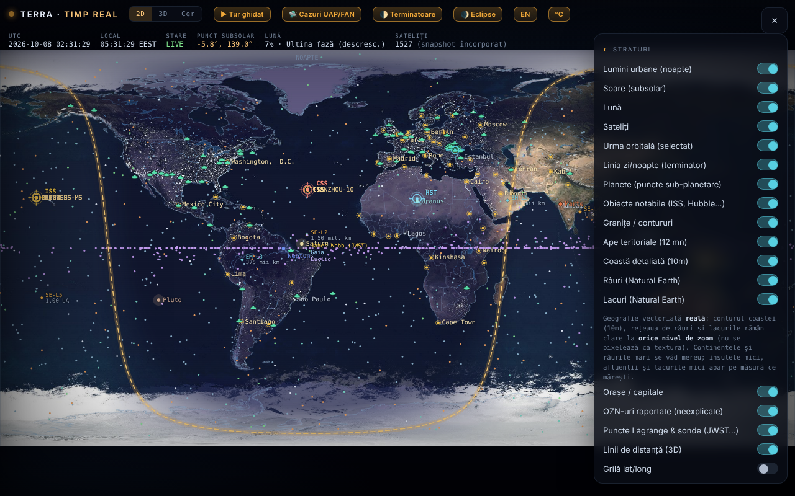

# Terra — Pământul în timp real

Harta și globul Pământului cu terminatorul zi/noapte, Luna, planetele, sateliții și un mod „Cer" (planetariu), într-un singur fișier HTML.

**Live:** https://chiuta.github.io/TerRa/

## Ce este

Terra · timp real (titlul paginii: „Pământul în timp real — Terminator · Lună · Sateliți") calculează în browser poziția Soarelui, a Lunii, a planetelor și a sateliților și le afișează pe o hartă 2D, pe un glob 3D sau într-o vedere de planetariu („Cer"). Un snapshot de date orbitale este încorporat în fișier, deci funcționează și fără internet; feedurile live sunt opționale.

## Funcții

- Moduri: **2D**, **3D** și **Cer**, plus turuburi ghidate: „▶ Tur ghidat", „🌓 Terminatoare", „🌒 Eclipse" și „🛸 Cazuri UAP/FAN".
- Terminatorul zi/noapte calculat în timp real, lumini urbane pe partea de noapte, punctul subsolar, punctul sublunar și faza Lunii.
- Control al timpului: pauză/redare, viteze (1×, 60×, 600×, 3600×, 1 zi/s), salt rapid (−7z … +7z, ±1h) și „Moment exact (local)"; „⦿ Revino la acum (live)".
- Sateliți propagați cu SGP4 (orbite joase) și model kepleriano-J2 (geostaționari); categorii: stații spațiale, vizibili cu ochiul liber, Starlink, OneWeb, GPS, Galileo, GLONASS, BeiDou, științifici, meteo, observarea Terrei, geostaționari; încărcare de TLE propriu (text sau fișier).
- Planete și Pluto/Charon ca puncte sub-planetare; obiecte notabile (ISS, Tiangong, Hubble), puncte Lagrange și sonde (JWST, Gaia, Euclid, SOHO, DSCOVR); listă de OZN-uri raportate (documentează relatări, nu afirmă origine extraterestră).
- Straturi: granițe, ape teritoriale, coastă detaliată, râuri și lacuri (Natural Earth), orașe / capitale, grilă lat/long, relief fractal procedural, hartă verticală pentru mobil.
- Modul „Cer": Calea Lactee, obiecte Messier, constelații, roiuri de meteori, ecliptica, observator de pe sol sau de pe alte corpuri; „Îndreaptă spre cer (AR)" cu busola/giroscopul telefonului.
- Treceri vizibile ale ISS pe 48 h, cu alertă (vibrație + notificare); mediu de suprafață și maree de echilibru pentru locația aleasă.
- Feeduri live opționale: avioane (ADS-B), baloane-sondă meteo, radar meteo, vreme spațială NOAA (Kp, vânt solar, raze X, oval auroral), cutremure USGS (24 h), Movebank, flux GTFS-RT prin proxy.
- Interfață în română și engleză (buton „EN" / „RO").

## Manual de utilizare

1. Deschideți pagina; alegeți **2D**, **3D** sau **Cer** din bara de sus.
2. Setați locația în panoul „Locația mea" (buton „📍 Detectează" sau coordonate manuale) pentru treceri ISS, maree și vederea de pe sol.
3. Deschideți ☰ pentru „Straturi" și celelalte panouri; bifați ce doriți să vedeți.
4. Controlați timpul din bara de jos (pauză, viteză, salturi, „Moment exact"); „⦿ Revino la acum (live)" revine la ora curentă.
5. Trageți pentru a roti/panorama, derulați sau ciupiți pentru zoom; atingeți un satelit sau un marcator pentru detalii și urma orbitală. În modul 3D, tastele `[` și `]` derulează perspectivele de observare.
6. Pentru date actuale: „⟲ Actualizează (online)" în panoul de sateliți; „↺ Revino la snapshotul offline" revine la datele încorporate.
7. Feeduri live: apăsați butoanele „Adu …" din panourile respective (ele sunt oprite implicit).
8. Schimbați limba cu butonul „EN"/„RO".

## Confidențialitate și rețea

- Aplicația nu folosește cookie-uri, `localStorage` sau alt tip de stocare locală (nu am găsit apeluri de stocare în cod) și nu are analitice.
- Fără acțiunile dumneavoastră, aplicația nu face cereri de rețea. Când activați funcții online, browserul contactează direct:
  - `celestrak.org` (TLE sateliți) și, ca rezervă, `raw.githubusercontent.com` (oglindă CelesTrak);
  - `services.swpc.noaa.gov` (vreme spațială, oval auroral) și `earthquake.usgs.gov` (cutremure);
  - `api.open-meteo.com` (meteo curent la locația aleasă);
  - `opendata.adsb.fi` și `api.adsb.lol` (avioane în jurul locației dumneavoastră, coordonatele sunt trimise în cerere);
  - `api.v2.sondehub.org` (baloane-sondă), `api.rainviewer.com` și `tilecache.rainviewer.com` (radar meteo), `www.movebank.org` (date de animale, studii publice);
  - `corsproxy.io`, doar dacă introduceți/folosiți un proxy CORS pentru surse care nu permit accesul direct; proxy-ul vede cererea respectivă (aplicația avertizează explicit).
- Geolocația („📍 Detectează") se cere doar la apăsare; notificările pentru alerta ISS doar dacă activați alerta.

## Rulare locală / offline

Descărcați `index.html` și deschideți-l în browser. Poziția Soarelui, Lunii, planetelor, terminatorul, eclipsele și sateliții din snapshotul încorporat funcționează fără internet; actualizarea TLE și feedurile live necesită internet.

## Licență

CC0 1.0 Universal (domeniu public) — vezi fișierul LICENSE

## Autor

Alexio — Alexandru-Ionuț Chiuță. Contact: alexio@trom.tf

## English summary

Terra is a single-file real-time Earth viewer: day/night terminator, Moon, planets, satellites (SGP4), eclipses, a 3D globe and a sky planetarium mode, with RO/EN UI. An orbital snapshot is embedded, so it works offline. Optional live feeds contact CelesTrak, NOAA SWPC, USGS, Open-Meteo, adsb.fi/adsb.lol, SondeHub, RainViewer, Movebank and, if configured, a CORS proxy (corsproxy.io). No local storage. CC0 1.0.
